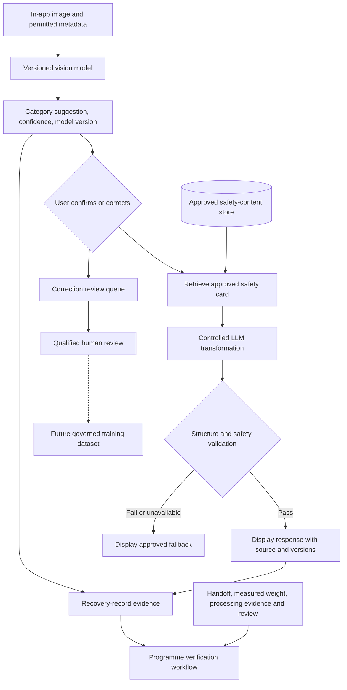

# AI system overview

## Status and purpose

This is the SRS-aligned logical design. The repository currently implements no AI capability. AI assists category suggestion and controlled language transformation; it is not the system of record and cannot verify recycling by itself.

## Separate responsibilities

| Capability | Responsibility | Must not do |
|---|---|---|
| Computer-vision model | Suggest one of the seven supported categories with confidence and model version | Determine weight, value, condition, processing, or verification |
| Approved safety-content store | Hold reviewed, versioned safety-card fields and provenance | Contain generated guesses or unapproved advice |
| Safety-content retrieval | Select an approved card by confirmed/manual category, language, and current approval state | Search unrestricted content or infer missing facts |
| LLM explanation layer | Explain, simplify, translate, or prepare read-aloud wording from retrieved approved content | Add facts, override content, diagnose, promise prices, or approve recyclers |
| Human review | Review corrections, safety content, model candidates, uncertain records, and release evidence | Treat one reviewer action as authority for unrelated purposes |
| Model and prompt versioning | Link every material AI output to reproducible model, policy/prompt, content, and validation versions | Reuse mutable labels such as “latest” as audit identity |
| User correction | Let a user reject a prediction while preserving prediction, confidence, version, and correction | Immediately retrain or silently overwrite the original result |
| Programme verification | Combine authorised collector, handoff, measured weight, processing, and review evidence | Accept an AI classification, confidence, image, or LLM response as proof of recycling |

## Logical flow

The dotted arrow indicates a future, permission-dependent dataset decision—not online learning.

## Trust boundaries

- Images, user text, provider responses, cached data, and corrections are untrusted inputs.
- `packages/safety-content` is the proposed canonical approved-content boundary; approval metadata is part of the content, not optional decoration.
- `services/vision` owns training, evaluation, release, and inference concerns.
- `services/safety-assistant` owns retrieval, provider adapters, grounding, validation, and fallbacks.
- `apps/api` orchestrates authorised workflows through contracts; it does not absorb private model or safety internals.
- Operational recovery records do not automatically become training datasets.

## Version and provenance chain

A category suggestion should retain model identifier, artefact checksum, category-definition version, inference time, and confidence. A generated guide should retain approved-card identifier/version/language, prompt/policy version, provider/model identity, validator version/result, and generation/cache status. Final contracts and retention require approval.

## Human decisions

Humans remain responsible for safety-card approval, label admission, model release, response evaluation, record review, and programme verification according to separated roles. Automation may prioritise or flag cases but must not hide uncertainty or remove contestability.

## Failure principle

If classification is unavailable or uncertain, the user may select a category and see only an approved fallback where available. If approved safety content, validation, or the LLM is unavailable, the LLM must not continue or guess. If evidence is incomplete, programme verification remains incomplete or under review.
