# SRS analysis models

These maintainable Mermaid models mirror Figures 1–14 in the [approved SRS v1.1](<../product/ScrapTrace_Software_Requirements_Specification (2).docx>). They describe required behaviour and logical structure, not implemented components. The SRS remains authoritative; [SRS parity notes](../product/srs-traceability.md#srs-interpretation-notes) govern known source inconsistencies.

## Figure 1 Application system context

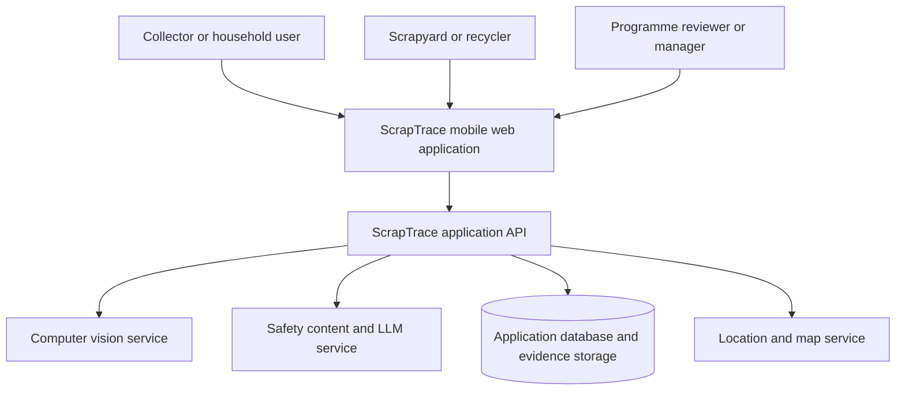

## Figure 2 End-to-end application journey

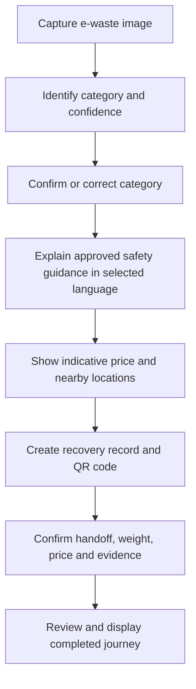

## Figure 3 Logical components and external providers

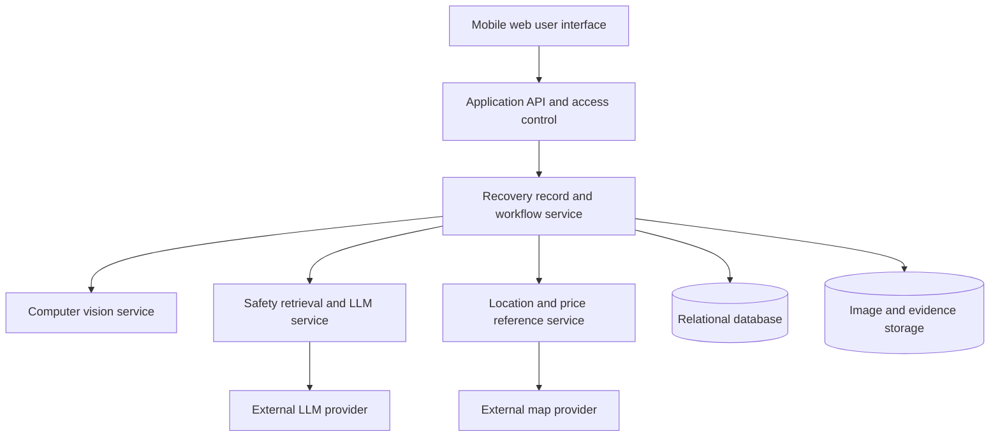

## Figure 4 Core data relationships

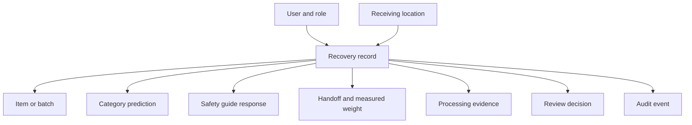

## Figure 5 Grounded LLM safety-guidance flow

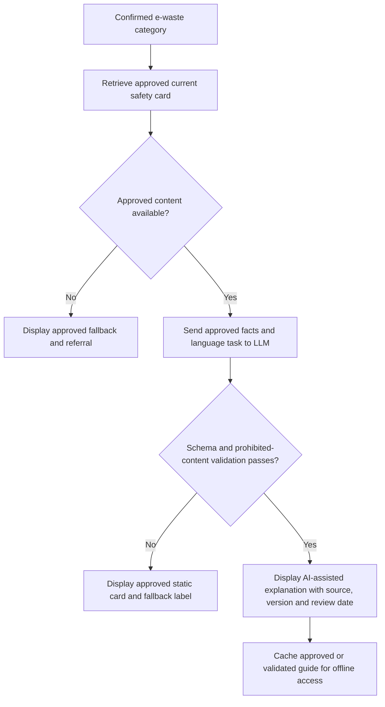

## Figure 6 Offline-save and synchronization decisions

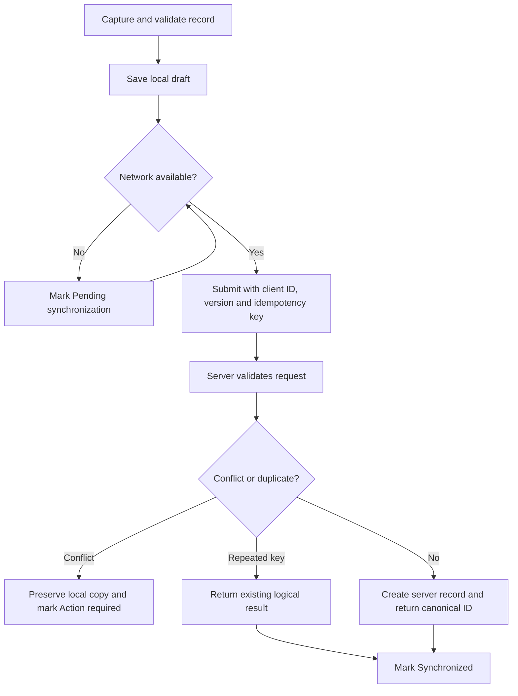

## Figure 7 Recovery-record lifecycle overview

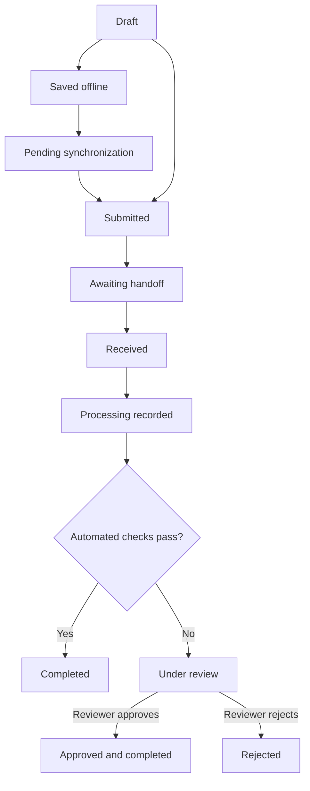

`Approved and completed` is the state eligible for verified-weight totals. See the [state interpretation](../product/srs-traceability.md#srs-interpretation-notes).

## Figure 8 Handoff and review interaction sequence

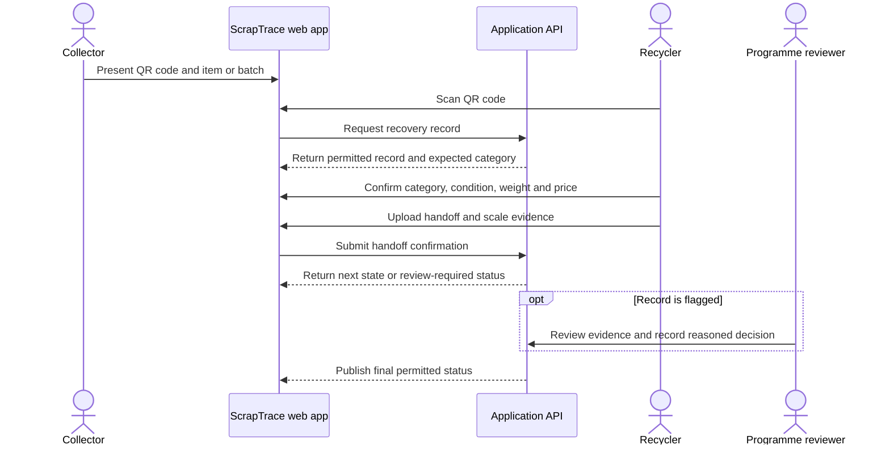

## Figure 9 Context data-flow diagram

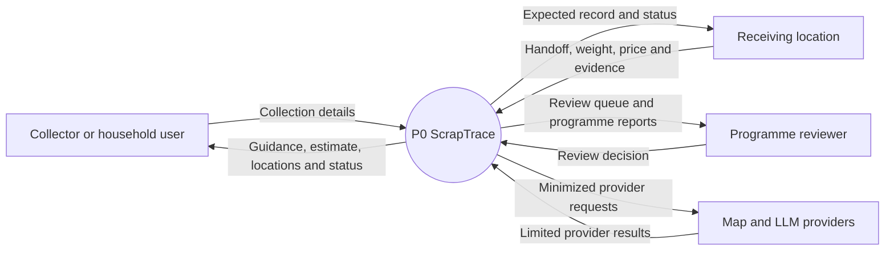

## Figure 10 Level 1 data-flow diagram

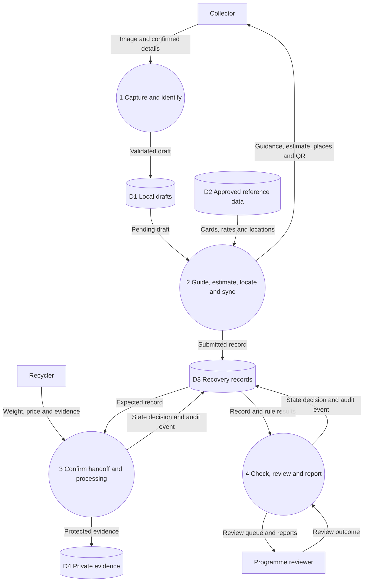

## Figure 11 UML use-case model

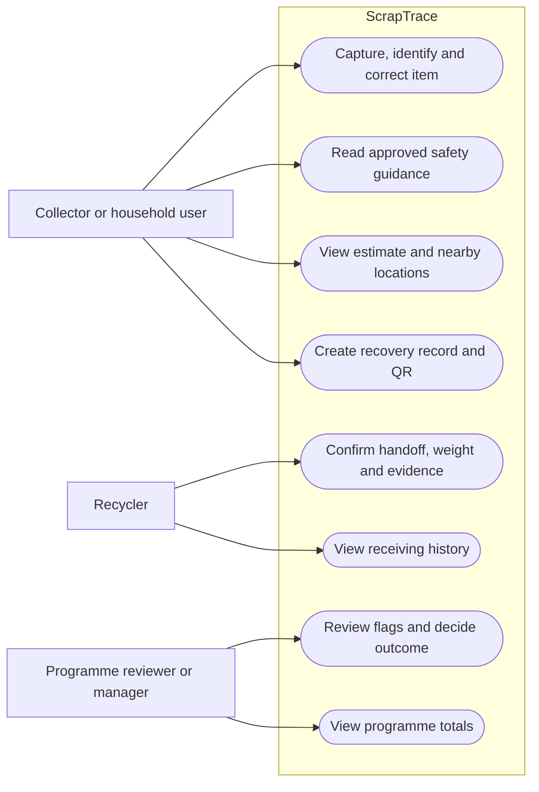

Content administrators and data reviewers are additional access roles defined by FR-ACC-001; their governed content/model-review use cases sit outside the core traceability use-case figure.

## Figure 12 UML domain class model

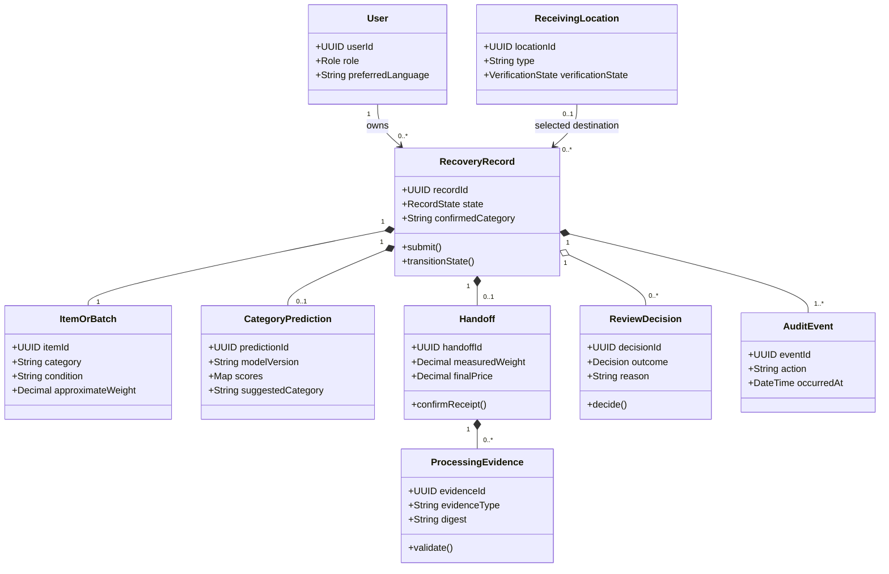

## Figure 13 Recovery-record state-transition model

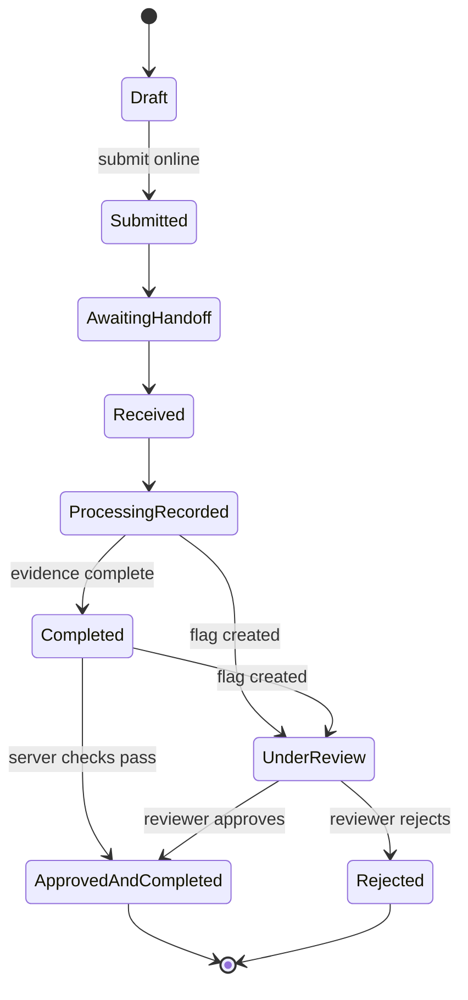

The server rejects transitions not shown or not authorised for the actor. Synchronization states remain orthogonal. Information-request handling is a review action and must not erase the prior state or evidence. See [ADR-003](../decisions/ADR-003-recovery-record-lifecycle.md) for the recorded resolution of the source-diagram ambiguity.

## Figure 14 Core traceability entity-relationship model

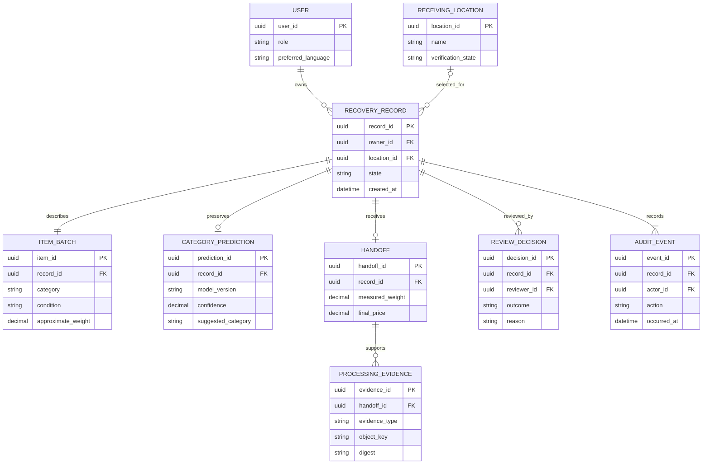

Safety-card versions, LLM responses, price references/estimates and language bundles are additional governed entities described in the [data-model overview](../data/data-model-overview.md); the SRS Figure 14 intentionally focuses on the core traceability path.
