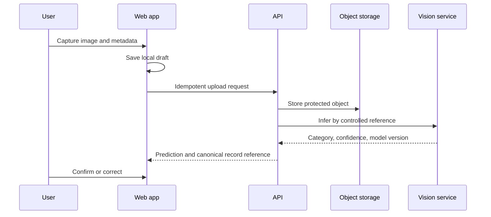
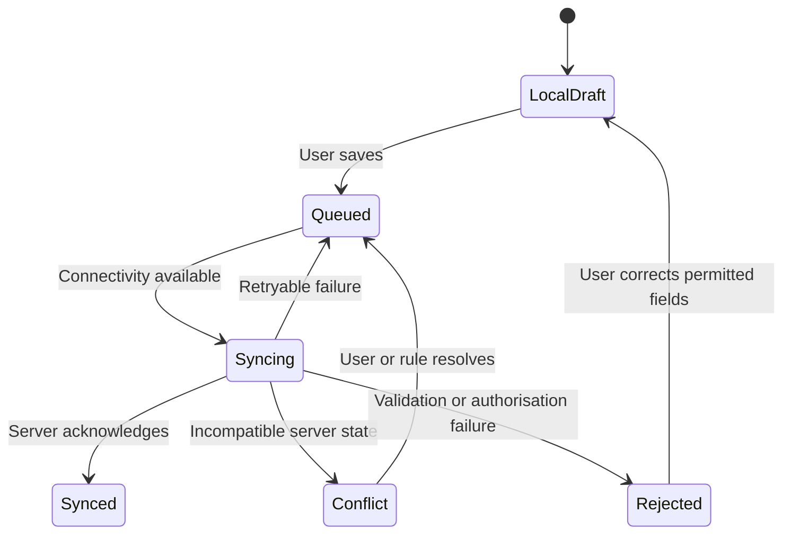

# Data flow

These flows are **proposed** logical flows. Exact schemas, protocols, retention, and deployment topology are not implemented. In every flow, source evidence, user statements, predictions, estimates, measurements, and review decisions must remain distinguishable.

## Image-capture flow

1. The web app requests camera and optional location permission and captures a new image in-app.
2. The app stores a local draft with capture time, provenance, and a local identifier; precise-location handling follows a privacy policy **to be decided**.
3. When online, the API authorises an upload, validates metadata, and stores the image in object storage with checksum/reference metadata in the database.
4. The API requests vision inference with an authorised object/reference, not an unrestricted public URL.
5. The vision service returns category, confidence, and model version.
6. The user confirms or corrects the category; both prediction and correction remain in history.

## Safety-guide flow

1. The confirmed or manually selected category and preferred language reach the API.
2. The safety service retrieves the matching approved, versioned card from `packages/safety-content`.
3. If online generation is enabled, the service asks a provider-independent LLM to explain or translate only the approved content.
4. Guardrails validate that the response is attributable to the card; the response includes provenance.
5. If content, provider, or validation is unavailable, the service returns an approved fallback and does not guess.
6. The client may cache the approved card and previously generated guide with version/freshness metadata.

## Recovery-record flow

1. The user enters item/batch type, category, count, condition, approximate location, chosen destination, and optional permitted estimate inputs.
2. The client validates and locally saves a draft; the API repeats authoritative validation after synchronisation.
3. The API creates one canonical record using an idempotency key and assigns a unique identifier.
4. A QR representation references the identifier without embedding unnecessary personal data.
5. The API appends state and evidence events; it does not overwrite source facts with derived values.
6. The user sees a journey assembled from authorised events and current state.

## Offline synchronisation flow

Each queued command carries a stable operation identifier/idempotency key. The server records a single effect, returns the canonical mapping, and handles duplicates consistently. Client acknowledgement is removed only after durable server acknowledgement. Conflict policy is field/state specific and **to be decided**; silent last-write-wins is not the default for evidence.

## Recycler-confirmation flow

1. An authorised recycler scans the QR code and the API returns the permitted record view.
2. The recycler compares the physical delivery with collector information.
3. Measured weight, final buying price, facility, time, actor, and scale/delivery evidence are submitted as new facts.
4. Validation checks required fields, record state, and repeated operation identifiers.
5. Discrepancies remain visible and may trigger review rather than overwriting collector data.
6. Processing outcome and evidence are appended later; only defined complete records can proceed to verified reporting.

## Review flow

1. Rules create reason-coded flags for low confidence, category mismatch, suspected repeated image, unusual weight, or missing evidence.
2. An authorised reviewer obtains the minimum necessary evidence, history, and relevant versions.
3. The reviewer approves, rejects, requests information, or escalates and records a reason.
4. The API appends the decision and recalculates eligible state/reporting projections.
5. Model-data admission is a separate consented data-review flow; record approval alone does not authorise training use.

## Reporting flow

1. The dashboard sends authorised programme scope and filters to the API.
2. The API builds projections from canonical records and review states.
3. Verified aggregates include only records satisfying the accepted completeness and review rules.
4. Pending, flagged, rejected, and unsynchronised data is displayed separately where authorised.
5. Public or broad views remove personal collector details and apply disclosure controls **to be decided**.
6. Every view reports definitions and freshness; prototype output is not automatically an official report.
