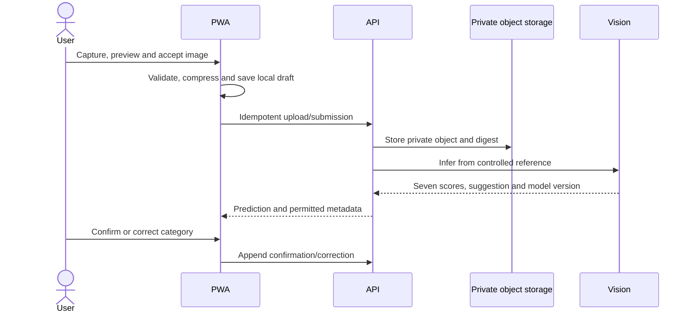

# Data flow

The flows below implement the [approved SRS](<../product/ScrapTrace_Software_Requirements_Specification (2).docx>) at logical-design level. They preserve capture facts, predictions, confirmations, estimates, measurements, evidence and decisions as separate provenance-bearing values. Formal DFD, UML, state and ER models are in [SRS analysis models](analysis-models.md).

## Image capture and prediction

1. The PWA requests camera permission only when capture begins, validates type/size and compresses the accepted image toward the 2 MB target.
2. It creates a user-scoped local draft before any network submission, retaining only safe metadata and consented approximate area.
3. When online, the API authorises upload, generates the private object key, stores integrity metadata and asks the vision service for all seven scores plus model version.
4. The interface expresses confidence in plain language and requires confirmation or another supported category.
5. Original prediction and correction remain immutable/separate; a correction may enter human review but cannot retrain/deploy automatically.

## Safety-guide flow

The confirmed category selects a current `Approved` card. The LLM receives only card facts, requested language and constrained transformation instructions—never identity, precise coordinates or image. The server validates schema and prohibited actions before display. Provider failure/invalid output returns reviewed static content; absent approved content causes no LLM call and returns a reviewed referral. The exact decision flow is [Figure 5](analysis-models.md#figure-5-grounded-llm-safety-guidance-flow).

## Estimate and location flow

1. Estimation reads confirmed category, count, selected condition, active dated price reference and, for mixed scrap, positive approximate weight/unit.
2. Result stores inputs, minimum/maximum, currency, unit/basis, source and update date; it remains distinct from final price.
3. Location search reads a permissioned coordinate or manual approximate area, filters published compatible profiles and ranks by straight-line distance.
4. Results expose type, verification state/date, accepted category, hours, contact and freshness. Map/directions are provider capabilities, not approval evidence.
5. No reference/no match returns no invented price/location and uses the approved fallback.

## Recovery-record and QR flow

1. Item or batch input is authoritatively validated; mixed scrap defaults to batch.
2. Client ID and idempotency key map to one canonical server record.
3. The API persists record facts and an initial append-only audit event, then returns canonical ID, short code and opaque QR lookup token/URL.
4. QR contains no name, phone or coordinates and reveals only a permitted intake view after authorisation.
5. Every accepted transition is server-controlled, version checked and audited.

## Offline synchronization flow

The client stores ID, idempotency key, creation time, local version and sync state. It uses bounded exponential backoff on transient failure. A repeated key returns the prior logical result. A version conflict retains both values, stops automatic overwrite and shows `Action required`. See [Figure 6](analysis-models.md#figure-6-offline-save-and-synchronization-decisions) and [offline-first design](offline-first-design.md).

## Recycler handoff and processing

1. The authorised recycler scans/enters code; API returns only intake-required category, item/batch type and non-sensitive evidence.
2. Recycler independently confirms category/condition and records positive measured weight/unit and non-negative final price/currency.
3. Handoff photo and readable scale evidence are uploaded privately with receiver, location, server time and client capture time.
4. Estimate is not overwritten. Disagreement, unusual weight or duplicate evidence creates a named review flag.
5. Recycler adds controlled processing result/date/notes/evidence. This does not create statutory certification.

## Review flow

Rules evaluate required evidence, exact digest reuse, category disagreement, weight threshold and state validity. Flagged records enter `Under review`, are excluded from approved totals and show that a flag is not proof of fraud. The reviewer sees required history/versions and approves, requests information or rejects with reason. Decisions append audit events and never erase evidence.

## Reporting flow

Dashboard requests carry actor and programme/location scope plus filters. API projections expose freshness and reconcile to source records. Verified-weight totals include only `Approved and completed` records with units. Draft, pending synchronization, under-review and rejected records remain separate. Exports, if implemented, exclude private image URLs, phone numbers and precise coordinates.

## Provider and failure boundaries

- Vision failure preserves manual selection and draft creation.
- LLM failure returns approved static text.
- Map failure retains the cached compact directory and manual area path.
- Object-upload failure leaves evidence pending and never marks processing complete.
- Network failure keeps local work and never implies server receipt.
- Optional TTS, simulated incentive and exports can be disabled without breaking Must flows.
