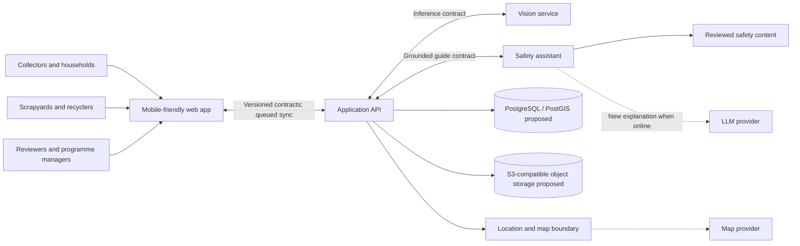

# System overview

## Status and scope

The repository currently contains documentation and directory placeholders only. The architecture below is **proposed**, not implemented. It supports the required [hackathon scope](../product/prototype-scope.md) while keeping future financial and government capabilities outside the active boundary.

## Proposed components

- **Mobile-friendly web application:** collector, household, recycler, reviewer, and manager experiences; local drafts, cache, and synchronisation status.
- **Application API:** identity/authorisation boundary, workflow orchestration, validation, records, review, reporting, and access to storage and external adapters.
- **Computer-vision service:** versioned model training, evaluation, and inference for the seven supported categories.
- **Safety information and LLM service:** retrieves reviewed safety cards and constrains provider-independent LLM explanation or translation to that material.
- **Database:** proposed relational system of record for identities, roles, locations, recovery records, measurements, processing results, review decisions, and audit references.
- **Object storage:** proposed storage for images and processing evidence, referenced by controlled metadata rather than embedded in transactional records.
- **Location service:** participating-location search, distance/ranking, directory metadata, and map/directions-provider boundary.
- **Recycler interface:** role-specific web experience for QR retrieval, receipt, measured weight, price, and processing evidence.
- **Programme dashboard:** role-specific web experience for review queues, status-separated aggregates, verified weight, and journey inspection.

The recycler interface and dashboard may initially be routes within the web application; their access boundaries remain distinct. A separate deployable location service is **to be decided** and may begin as an API module.

## Context diagram

Dashed arrows denote external provider integrations. The database, object storage, and named technologies are proposals pending validation.

## Core architectural principles

1. **Offline state is explicit.** Local save is not server receipt, and server receipt is not verified recycling.
2. **Evidence is cumulative.** Collector capture, recycler confirmation, measured weight, processing evidence, and human review remain distinguishable.
3. **Safety content is controlled.** The LLM transforms approved content; it is not the source of safety truth.
4. **Derived values keep provenance.** Predictions and estimates do not overwrite user input or measurements.
5. **Integrations are replaceable boundaries.** LLM, map, storage, payment, and government providers do not define core records.
6. **Least privilege applies.** Roles see only information required for their actions; public reporting excludes collector identity.

## Current implementation

There is no current application architecture to operate: no source code, API, database, model, content catalogue, provider connection, or deployment has been created. Accepted repository organisation is recorded in [ADR-001](../decisions/ADR-001-monorepo-structure.md). Other architecture and technology choices remain proposed.
