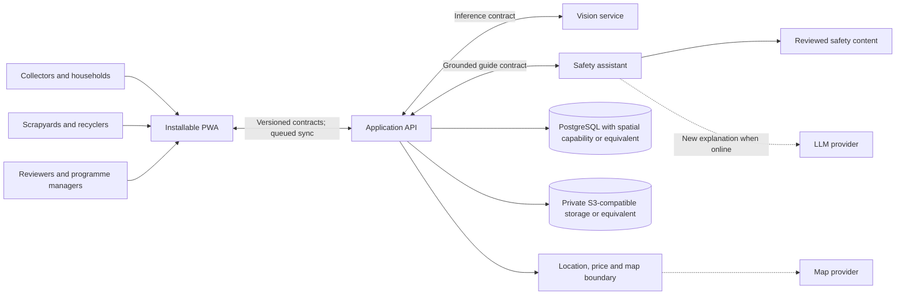

# System overview

## Status and scope

The [approved SRS v1.1](<../product/ScrapTrace_Software_Requirements_Specification (2).docx>) defines the required logical architecture below. The repository still contains documentation and directory placeholders only; no component is implemented. Financial, certification and government capabilities remain outside the active boundary.

## Application components

- **Installable progressive web application:** collector/household, recycler, reviewer, manager, content-administrator and data-reviewer experiences; service-worker caching, user-scoped local drafts and synchronization status.
- **Application API and workers:** authentication/authorisation, workflow orchestration, validation, state transitions, records, review, reporting, imports and asynchronous processing.
- **Computer-vision service:** versioned model training, evaluation, and inference for the seven supported categories.
- **Safety information and LLM service:** retrieves reviewed safety cards and constrains provider-independent LLM explanation or translation to that material.
- **Database:** PostgreSQL with spatial capability or an accepted equivalent for users/roles, locations, recovery records, measurements, processing, reviews and audit events.
- **Object storage:** private S3-compatible storage or an accepted equivalent for images/evidence, referenced by controlled metadata rather than database blobs.
- **Location and price reference capability:** participating-location search/ranking, checked directory metadata, dated rates and map/directions-provider boundary.
- **Recycler interface:** role-specific web experience for QR retrieval, receipt, measured weight, price, and processing evidence.
- **Programme dashboard:** role-specific web experience for review queues, status-separated aggregates, verified weight, and journey inspection.

The recycler interface and dashboard can be routes within the PWA while retaining distinct access boundaries. Location and price functions can begin as API modules; separate deployment requires an ADR rather than being assumed.

## Context diagram

Dashed arrows denote external provider integrations. Named technologies are SRS constraints with documented alternatives where the SRS permits an equivalent.

## Core architectural principles

1. **Offline state is explicit.** Local save is not server receipt, and server receipt is not verified recycling.
2. **Evidence is cumulative.** Collector capture, recycler confirmation, measured weight, processing evidence, and human review remain distinguishable.
3. **Safety content is controlled.** The LLM transforms approved content; it is not the source of safety truth.
4. **Derived values keep provenance.** Predictions and estimates do not overwrite user input or measurements.
5. **Integrations are replaceable boundaries.** LLM, map, storage, payment, and government providers do not define core records.
6. **Least privilege applies.** Roles see only information required for their actions; public reporting excludes collector identity.
7. **Server authority controls lifecycle.** The API rejects invalid or unauthorised transitions and records every accepted material action.
8. **Optional integrations are isolated.** Simulated incentives, TTS and external providers can be disabled without breaking the Must journey.

All fourteen SRS figures are represented in [SRS analysis models](analysis-models.md).

## Current implementation

There is no current application architecture to operate: no source code, API, database, model, content catalogue, provider connection, or deployment has been created. Accepted repository organisation is recorded in [ADR-001](../decisions/ADR-001-monorepo-structure.md). Other architecture and technology choices remain proposed.
