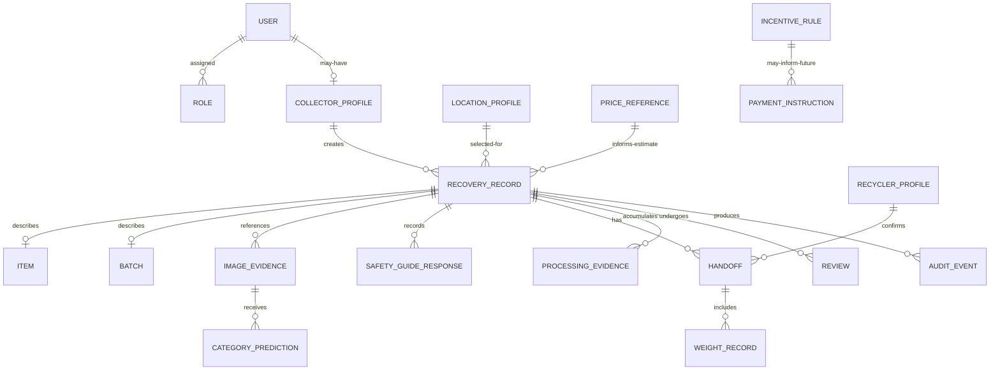

# Data-model overview

## Status and modelling principles

This is the SRS-required logical model, not a physical database schema. Entity boundaries may become tables, documents, aggregates, or external references only after contract, privacy, security and offline design. The core ERD is [Figure 14](../architecture/analysis-models.md#figure-14-core-traceability-entity-relationship-model).

- Preserve source facts, user assertions, predictions, estimates, measurements, and review decisions separately.
- Use stable identifiers and append/version material evidence rather than silently overwriting it.
- Store binary evidence in private S3-compatible object storage or an accepted equivalent; records hold controlled references and integrity metadata.
- Minimise identity and precise location, scope access by role/programme/resource, and separate operational data from training datasets.
- A future entity does not imply an implemented or authorised integration.

## Logical entities

| Entity | Purpose and key information | Relationships | Sensitivity | Authoritative owner | Lifecycle |
|---|---|---|---|---|---|
| User | Account identity, status, preferred language, authentication reference; avoid unnecessary profile data | Has roles; may link to collector/reviewer/operator profiles and audit events | Confidential; authentication references restricted | Identity/platform owner | Created, verified/activated if required, updated, suspended, deleted/deidentified per policy |
| Role | Collector, recycler, reviewer, manager, content administrator or data reviewer plus assigned programme/location scope | Assigned to users; evaluated server-side for every protected operation | Internal; assignments confidential | Security/platform owner with programme approval | Versioned; assignment/revocation audited |
| Collector profile | Minimum programme identity/contact/payment reference if future-authorised | Belongs to user; linked from recovery records through controlled reference | Confidential/restricted | Programme operations/privacy owner | Enrolled, updated, suspended, retained/deleted per programme/legal rules |
| Location profile | Participating place type, coordinates, contact, hours, accepted categories, freshness and verification evidence/status | Selected by recovery records; may link to recycler profile | Public fields plus confidential/restricted verification data | Programme/location-directory owner | Draft, reviewed, published, expired/withdrawn, archived |
| Recycler profile | Facility/operator identity, programme participation, status evidence and allowed actions | May correspond to location and users; receives handoffs | Public, confidential, or restricted by field | Programme owner; external authority remains authoritative for approval | Proposed, reviewed, active, suspended/expired, archived |
| Item | One large/individually tracked e-waste unit and user-stated attributes | Included in one or more governed record stages; belongs to a recovery record | Internal/confidential depending on linkage | Application API/recovery domain | Draft through handoff/processing/history retention |
| Batch | Governed grouping of small parts or mixed scrap, count/approximate weight context | Recovery record contains/references batch; later measured at handoff | Internal/confidential | Application API/recovery domain | Draft, submitted, received, processed; composition corrections versioned |
| Recovery record | Central evidence aggregate linking collection through processing/review | References item/batch, collector, evidence, predictions, guide, destination, handoff, weight, processing, review, history | Confidential; some fields restricted | Application API/recovery domain | See [Recovery record](recovery-record.md) |
| Image evidence | Protected object reference, purpose, capture/upload provenance, checksum, time, metadata, consent/rights state | Attached to recovery, handoff, or processing events; not automatically training data | Restricted | Object/evidence owner under recovery domain | Captured/local, uploaded, validated, retained, deleted/quarantined per policy |
| Category prediction | Suggested category, confidence, model/category/contract versions, inference time/error | Linked to image and recovery record; compared with user confirmation | Internal; confidential when record-linked | Vision service for output; recovery domain for retained reference | Immutable prediction; superseded by new inference but not overwritten |
| Safety card/version | Category, language, five answer fields, emergency text, sources, version, approver, approval/review dates and status | Grounds guide responses; only current `Approved` versions are eligible | Internal until published | Safety/content administrator | Draft, Approved, retired/expired/withdrawn |
| LLM response | Card version, language, prompt/provider/model/validator versions, output, validation result, timestamp | Linked to source card and optionally recovery record/session | Internal/confidential depending on linkage | Safety-assistant service | Generated, validated/blocked, cached, expired/deleted |
| Handoff | Recycler/facility confirmation, server/client times, confirmed category/condition, measured weight/unit, final price/currency, discrepancies and evidence references | At most one baseline handoff per recovery record; links location/recycler and processing evidence | Confidential/restricted | Recovery domain with authorised recycler as source actor | Awaiting, received, processing recorded; source event append-only |
| Weight record | Measured value, unit, measurement time/source/device context if authorised, actor | Belongs to handoff/recovery record | Confidential; integrity-sensitive | Authorised recycler/recovery domain | Proposed measurement, recorded, corrected by append/review, retained |
| Processing evidence | Outcome/status assertion, actor/time, protected evidence references and review status | Belongs to recovery record and recycler | Restricted | Authorised recycler as source; programme review for acceptance | Submitted, incomplete/flagged, reviewed, retained/withdrawn by policy |
| Review | Reason-coded assignment, evidence considered, decision, rationale, actor/time | Targets recovery record, label, location, content, or other governed object | Restricted | Relevant review authority | Open, awaiting information, decided, appealed/reopened if policy allows |
| Audit event | Attributable material/security action, target, prior/new reference, reason, time, correlation | References governed entities without copying unnecessary content | Restricted | Platform/security/audit owner | Append-only, access-controlled, retained under approved schedule |
| Price reference | Category/condition/unit range, currency, source, geography, effective/update dates | Used to derive a labelled estimate; distinct from final price | Internal or public by source terms | Programme/commercial data owner | Draft, approved, current, stale/superseded, archived |
| Incentive rule | Future programme-defined eligibility, rate, funding, version, authority, effective dates | May evaluate only authorised verified records; separate from scrap price | Restricted | Authorised programme owner | **Future:** proposed, approved, effective, superseded/withdrawn |
| Payment instruction | Future idempotent request, beneficiary reference, amount/currency, rule/record basis, provider and settlement status | Derived only after separate authorisation; references incentive, record, and provider | Restricted/high impact | Authorised programme/financial integration owner | **Future only:** created, submitted, accepted/rejected, settled/reconciled/reversed as authorised |

## Ownership clarification

“Authoritative owner” identifies the logical steward inside ScrapTrace, not ownership of a person's data or external regulatory authority. A recycler's submitted fact remains attributed to that recycler; a programme review decision does not rewrite it. External authorities remain authoritative for certification, official reporting, incentives, and payment rules.

## Relationships at a glance

The diagram is conceptual and does not dictate cardinalities or schema. Item-versus-batch modelling, multiple handoffs/weights, review appeals, and future incentive relationships require domain approval.
