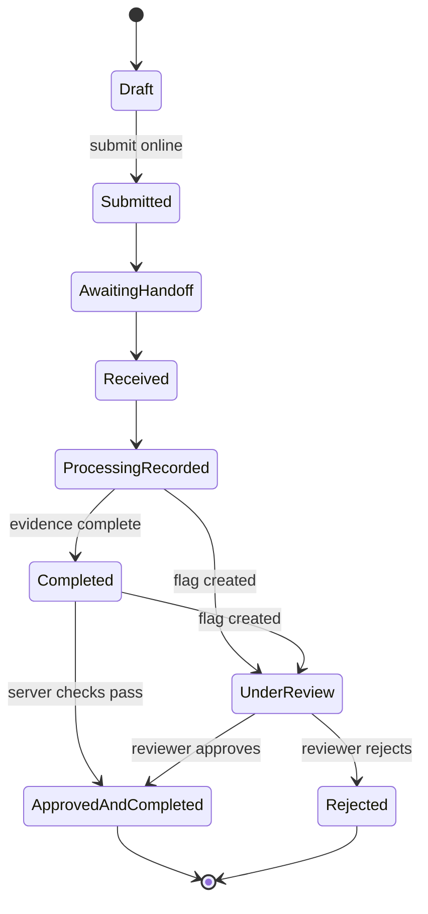

# Recovery record

## Aggregate purpose

The recovery record is the SRS-defined aggregate root linking collection, guidance, estimate, destination, handoff, processing and review. It preserves evidence from separate actors and never treats one image, QR code or location as proof of recycling. The API owns canonical state and rejects invalid or unauthorised transitions.

## Required contents

| Element | Minimum data and integrity rule |
|---|---|
| Identity | Opaque UUID/ULID-style `record_id`, client ID and human-readable short code; no embedded personal data |
| Owner and access | Private owner reference, role/programme/location scope and consent flags |
| Item or batch | Type, confirmed seven-group category, count or applicable approximate weight/unit, condition |
| Capture | Client capture time, server receipt time, approximate area and permission/precision metadata |
| Image/evidence | Private object key, type, digest, uploader, capture time and validation/moderation state |
| Prediction | Model version, all seven scores, suggested category and immutable original outcome |
| Confirmation/correction | Confirmed category, actor, time and optional reason, separate from prediction |
| Safety provenance | Card category/language/version, sources, approval/review dates and any prompt/provider/validator metadata |
| Estimate | Inputs, range, currency, unit/basis, source and effective date; separate from final price |
| Destination | Receiving-location ID plus profile type and verification-version reference |
| QR | Opaque lookup token/URL only; QR scan never creates another record |
| Handoff | Receiver/location, server/client time, category/condition confirmation, measured weight/unit, final price/currency and evidence IDs |
| Processing | Controlled result, date, operator, notes and protected evidence |
| Review | Named flag codes, severity/explanation, reviewer, decision/reason, requests and timestamps |
| Audit | Append-only actor, role, action, target, before/after references, UTC time, request/correlation ID |
| Synchronization | Local/canonical mapping, local/server version, idempotency key, attempt/outcome and user-visible sync state |

## Normative lifecycle

| State | Meaning |
|---|---|
| `Draft` | Editable local or online record not submitted. |
| `Submitted` | Canonical record accepted by the server. |
| `Awaiting handoff` | Record can be presented to a participating receiving location. |
| `Received` | Authorised recycler recorded handoff facts; processing is not yet complete. |
| `Processing recorded` | Controlled result and required evidence were submitted. |
| `Completed` | Required evidence is complete; final server checks have not yet marked it programme-approved. |
| `Under review` | At least one named flag remains unresolved; excluded from approved totals. |
| `Approved and completed` | Evidence-complete record accepted by the defined reviewer/rules and eligible for verified totals. |
| `Rejected` | Authorised reviewer rejected the record for the defined programme purpose with reason. |

The SRS diagram shows `Completed` as terminal while FR-REV-007, FR-DSH-004 and BR-010 allow only `Approved and completed` in verified-weight totals. [ADR-003](../decisions/ADR-003-recovery-record-lifecycle.md) resolves the contract ambiguity by treating `Completed` as evidence-complete but not final; an unflagged record advances after server checks, while a flagged record requires review. Plain `Completed` is never counted as programme verified.

## Synchronization status

Synchronization is orthogonal to lifecycle. User-visible values are `Offline`, `Pending synchronization`, `Synchronizing`, `Synchronized` and `Action required`. `Saved offline` describes durable local storage rather than a business state. A locally saved draft is not server-submitted, and server submission is not handoff or approval.

## Transition and mutation rules

- Validate supported category, positive weight with declared unit, non-negative price with currency and UTC timestamps server-side.
- Use optimistic concurrency/version checks and one idempotency key per logical mutation.
- Preserve local and server copies on conflict; never silently overwrite evidence.
- Keep prediction, user confirmation, recycler confirmation and reviewer decision separate.
- Version permitted changes after submission and retain prior values/actors.
- Attribute every accepted transition and material change through append-only audit events.
- Exact image-digest reuse, perceptual similarity, mismatch or unusual weight creates a review signal, not an automatic fraud decision.
- An information request does not erase `Under review`, its reasons or prior evidence.

## Identity and integrity

The canonical record ID and QR lookup token remain stable. Evidence digests, aggregate version and integrity metadata change as evidence is appended or corrected. This resolves the Concept Note's changing “special code” without breaking stable record lookup. Tokens are non-secret identifiers only after normal authorisation; possession alone does not grant access.

## Reporting eligibility

Only `Approved and completed` records contribute to verified-weight totals or simulated incentive eligibility. Dashboard queries exclude local-only, pending, draft, under-review and rejected records and always label units, freshness and filters. “Approved” is programme-specific evidence acceptance—not statutory certification, official EPR credit or universal proof of safe recycling.
